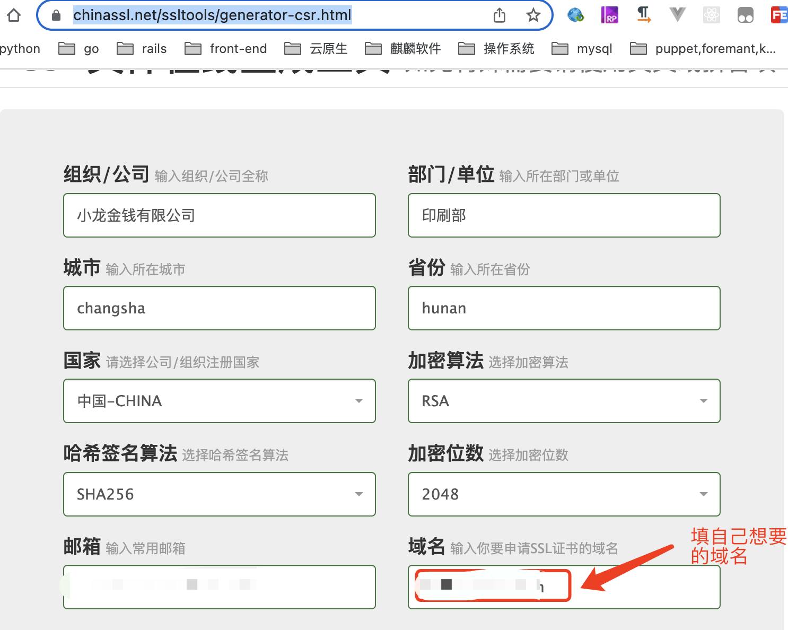
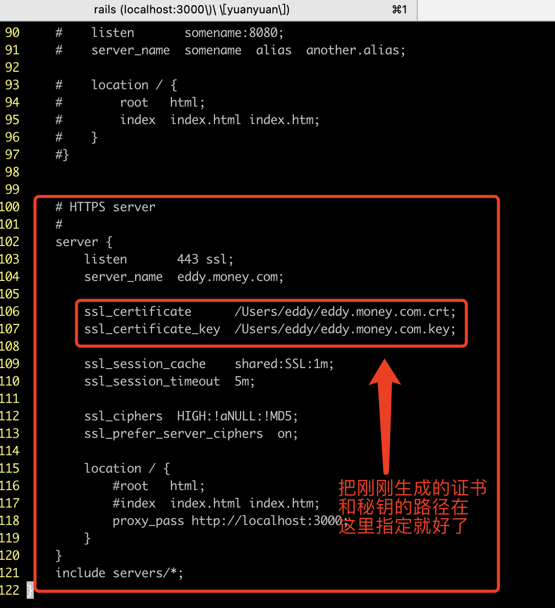
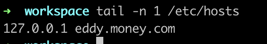
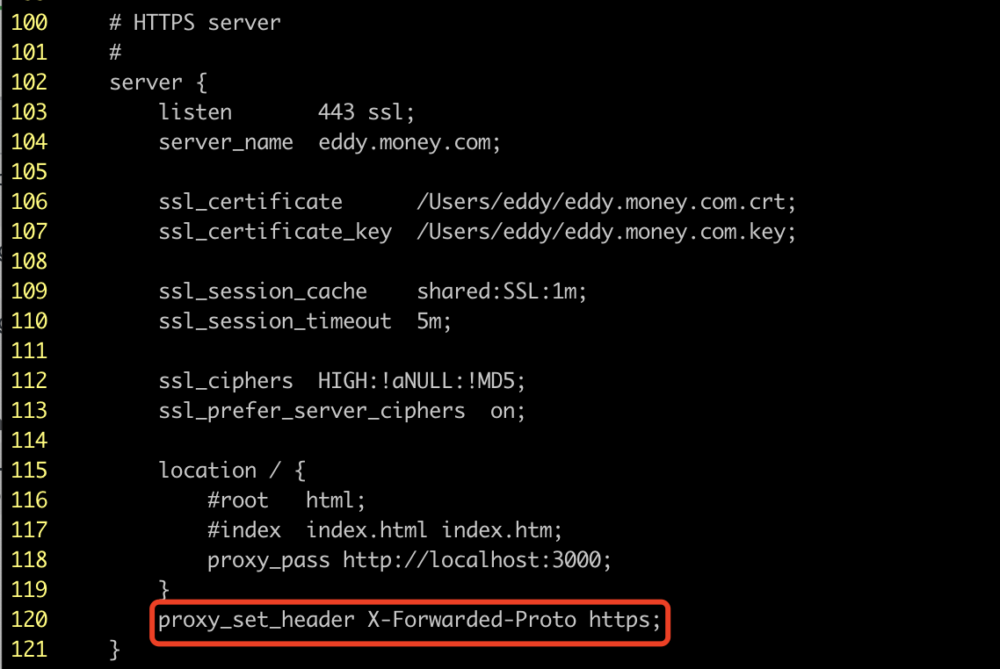

## 在本地模拟https请求
在本地主机即可模拟,通过在/etc/hosts中增加我们想要生成的域名的host,就可以使用这个域名来生成证书并在nginx中指定服务名了,大致步骤分两步: 1.生成证书      2.配置nginx
1.生成证书:
    1.1 生成秘钥和csr文件
        这里可以使用在线服务来生成https://www.chinassl.net/ssltools/generator-csr.html,

    1.2 生成证书,上一步生成的文件可以以域名.csr和域名.key来命名
        生成证书使用本机的openssl工具来生成: 
openssl x509 -trustout  -req -days 365 -in ~/eddy.money.com.csr -signkey ~/eddy.money.com.key  -out eddy.money.com.crt

2.配置nginx

3.我这里请求是转发到本地的3000端口,保证那个服务是打开的
    配置一下/etc/hosts

    浏览器访问eddy.money.com即可

4.有时候希望能够配置rails也强制限制只能使用https访问,rails应用有个配置config.force_ssl = true可以设置,但是如果我们使用nginx来做ssl代理的话,那么其实我们的rails应用仍然是一个普通的接收http请求的应用,就是说假设我们还保持了原有的http代理设置的情况下,原有的应用仍然可以通过http进行访问(这应该很正常,假设应用升级了https访问,那也应该保持原有的http链接也可以访问),为此需要增加两个配置代码:
    4.1 rails: production/development.rb:
config.ssl_options = {redirect: { host: "eddy.money.com", port: 443 }}
        通过ssl_options来指定重定向的地址,force_ssl的作用就是当请求不是https的时候将其重定向到https的链接上去,而默认会重定向到localhost:3000,因为rails应用并不知道外部配置的域名是什么
    4.2 nginx.conf:
    
        在https的服务配置下加上set_header,设置X-FORWARDED-PROTO头,这样再转发给rails应用的话,rails应用就能看到这个头了,因为force_ssl实质上就是通过这个头的值来判断是否为https请求的
        5.增加配置:
config.hosts << "eddy.money.com"
                rails会检查来访请求的host头,如果不为localhost就会不允许通过?,所以将此配置加入一下
